<!-- Heading -->

## Hi there 👋 I am Marco Cella

✨ I am a cloud platform engineer passionate about software development, Kubernetes, and cloud infrastructures.

<!-- Blog section -->

<h2>Blog</h2>

<a href="https://sitmcella.github.io">sitmcella.github.io</a>

<h2>Latest Blog posts</h2>

- [Reactive Streams with Spring WebFlux](https://sitmcella.github.io/?/post_20260221)
- [Toggl and Trello KPI Dashboard](https://sitmcella.github.io/?/post_20260125)
- [Azure Firewall Policy Update Automation](https://sitmcella.github.io/?/post_20251207)
- [Azure Firewall Manual Updates and IaC](https://sitmcella.github.io/?/post_20251026)
- [Azure PostgreSQL Backup with WAL-G](https://sitmcella.github.io/?/post_20250823)
- [Azure PostgreSQL Backup Automation](https://sitmcella.github.io/?/post_20250726)
- [Python and Cobol Integration](https://sitmcella.github.io/?/post_20250626)
- [PostgreSQL Triggers and notify/listen](https://sitmcella.github.io/?/post_20250525)
- [Server-Sent Events in React](https://sitmcella.github.io/?/post_20250427)

<!-- Connect section -->

<h2>Connect with me</h2>

   
  

<!-- GitHub section -->
 
<h2>GitHub Stats</h2>

<!--
**sitMCella/sitMCella** is a ✨ _special_ ✨ repository because its `README.md` (this file) appears on your GitHub profile.

Here are some ideas to get you started:

- 🔭 I’m currently working on ...
- 🌱 I’m currently learning ...
- 👯 I’m looking to collaborate on ...
- 🤔 I’m looking for help with ...
- 💬 Ask me about ...
- 📫 How to reach me: ...
- 😄 Pronouns: ...
- ⚡ Fun fact: ...
-->
